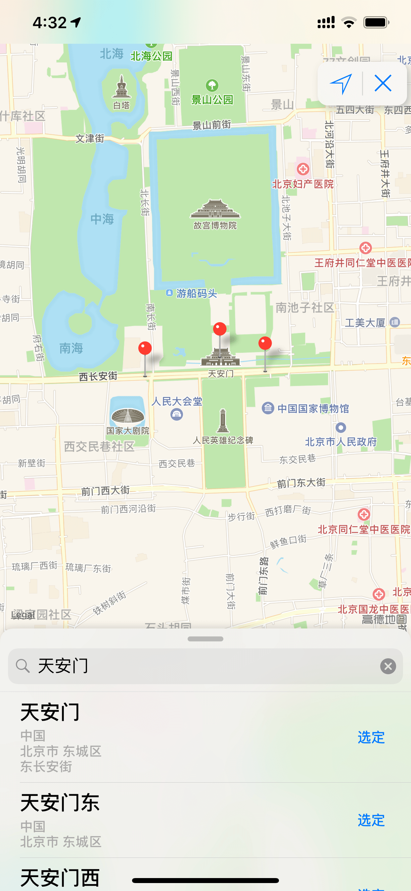

# LocationPicker

[](https://travis-ci.org/200739491@qq.com/LocationPicker)
[](https://cocoapods.org/pods/LocationPicker)
[](https://cocoapods.org/pods/LocationPicker)
[](https://cocoapods.org/pods/LocationPicker)

## Example

To run the example project, clone the repo, and run `pod install` from the Example directory first.

## Requirements

## Installation

LocationPicker is available through [CocoaPods](https://cocoapods.org). To install
it, simply add the following line to your Podfile:

```ruby
pod 'LocationPicker'
```

## Use

````swift
import CoreLocation
import LocationPicker

class ViewController: UIViewController {

    @IBOutlet weak var descLabel: UILabel!
    
    @IBAction func selectLocation(){
        
        let viewController = LocationPickerViewController()
        
        viewController.pickerDelegate = self
        
        self.present(viewController, animated: true, completion: nil)
    }
}

extension ViewController: LocationPickerViewControllerDelegate{
    
    func userDidCancel() {
        
        self.dismiss(animated: true, completion: nil)
    }
    
    func userSelectLocation(placemark: CLPlacemark) {
        
        self.dismiss(animated: true, completion: nil)
        
        descLabel.text = placemark.formatString
    }
}

````

## preview



-------


-------


-------


## Author

200739491@qq.com, 200739491@qq.com

## License

LocationPicker is available under the MIT license. See the LICENSE file for more info.
